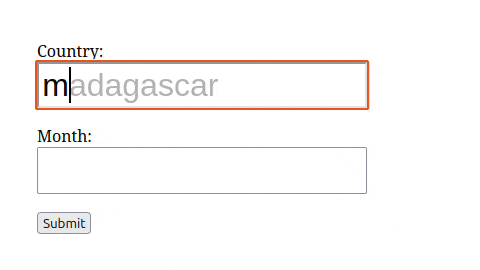

# ACJS - Inline Vanilla JavaScript Autocomplete for Input Fields

I couldn't find anything exactly like this when I needed it for my app, so I put it together.

The script copies the existing style elements from the input fields, so it should work with any CSS library, without damaging the layout. Tested only with Bulma so far.

As the user begins typing, the first suggestion appear inside the input box, no dropdowns anywhere at all. When the `Tab` or `Enter` key is pressed, the focus moves to the next input field based on the tabindex. See the example HTML for more details.




## Usage

1. Include the `ac.js` file at the end of your html, just before the `</body>` tag.

2. Call `initACJSInputs()` function.

3. Add `class="autocomplete-inputs"` to the input fields you want to have the autocomplete feature. Also, add `autocomplete="off"` to avoid browser's default autocomplete spoiling the fun.

4. Create the appropriate properties (arrays) of the ACJS object for each of your input fields, either manually or dynamically. *Hopefully I will soon prepare an **htmx** example of dynamically loading the suggestion array.*  
**NOTE: The name of the property must match the name of your input field** (like in the example code below, when your input field is named `month` you'll add `ACJS.month`).  
You can create as many input fields / value arrays as needed. 

### Finally, your html should look something like this:

```html
<!-- some html -->
 <input type="text" name="month" class="your-other-classes autocomplete-input" autocomplete="off">
 <!-- some html -->
<script src="js/ac.js"></script>
<script>
    initACJSInputs();

    ACJS.month = ["January", "February", "March", "April", "May", "June", "July", "August", "September", "October", "November", "December"];
</script>

</body>
</html>
```
## License
No license, feel free to contribute or use any other way you want.